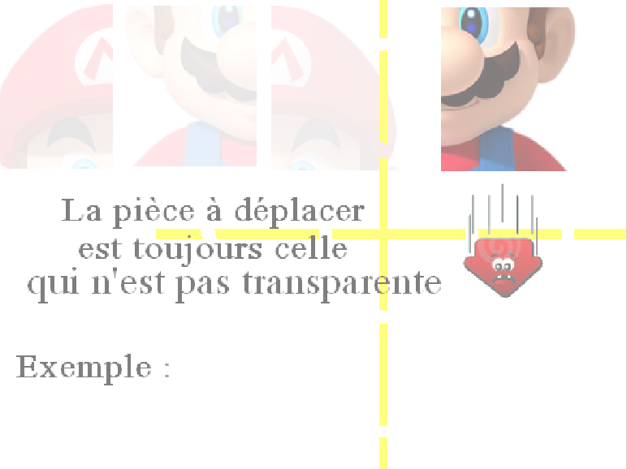
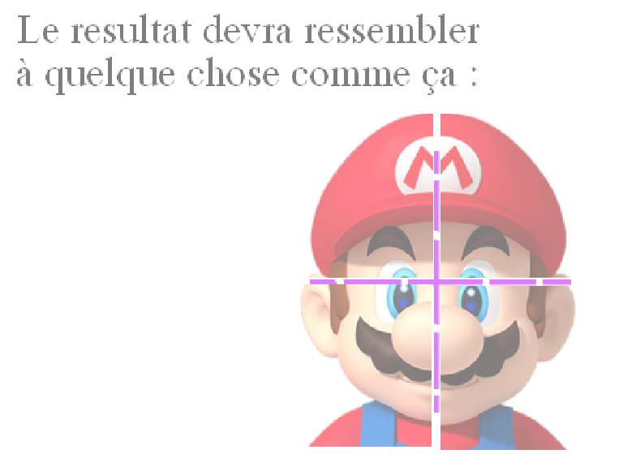

#LA FABRIK

Bonjour, je m'appelle Hasna CHADDOU.  
Je suis en formation web à la Fabrik.  
Le Fabrik est le nom de l'école du numérique créée par FACE Territoire Bourbonnais en 2016.  
FACE est une association qui regroupe un ensemble d'entrepreneurs qui a pour but de lutter contre toutes formes d'exclusions.  
La Fabrik regroupe 23 apprenants de différents âges aux profils hétéroclites, issus de différents milieux sociaux de la périphérie moulinoise.  
Cette formation qualifiante dans les métiers de la programmation web a pour finalité, pour la plupart des apprenants, de décrocher une place dans le monde du travail.
#ATELIER SCRATCH 1h-1h30

####Atelier développé pour minumum une personne, puis 1 encadrant pour 2 personnes et un encadrant en plus pour le groupe 
	(n visiteurs, donc (n/2)+1 encadrants)

#OBJECTIF : Créer un jeu à l'aide de Scratch

##Notions : 

- Notion basiques de l'algorithmie
- Manipulation des algorithmes
- Utilisation du logiciel Scratch

##Règles du jeu

#  
#  

##Déroulement de l'atelier

- Importer les pièces du puzzle de mario(sprites) et la musique du jeu
- Placer les sprites sur l'espace de travail (capteurs, croix et Mario)
- Donner la propriété fantôme au mario complet
- Création de la donnée pièces qui sera une variable
- Commencer l'algorithme, c'est à dire le code sur une pièce du mario (quand elle touche deux capteurs on ajoute pièce)
- Déterminer une exclusivité de chaque capteurs par pièce
- Déterminer quelle pièce bouge selon la valeur de la variable pièces et définir son opacité
- Affecter une limite de 4 à la variable pièces
- Quand la variable pièces est égale à 4, les 4 morceaux du Mario se rassemblent (transposition des coordonnées x et y)
- Activer la caméra et la musique au démarrage du jeu
- Affecter le mouvement de la caméra à chaque morceau du Mario (avec le déplacement)
- Bloquer la rotation des sprites du Mario
####BONUS
- Eteindre la caméra
- Message de victoire

##Elements de Scratch à utiliser

- répéter indéfiniment  [action]
- si  [action]
- comparateur ">", "="
- allumer video
- apparence fantôme
- Si costume est touché [action]
- Avancer de ''
- Au démarrage [action]
- Montrer / Cacher
- Bloquer rotation
- Changer direction

##Lien du jeu :
SANS SCRIPT : <https://scratch.mit.edu/projects/145639778/>

AVEC SCRIPT : <https://scratch.mit.edu/projects/145638690/>